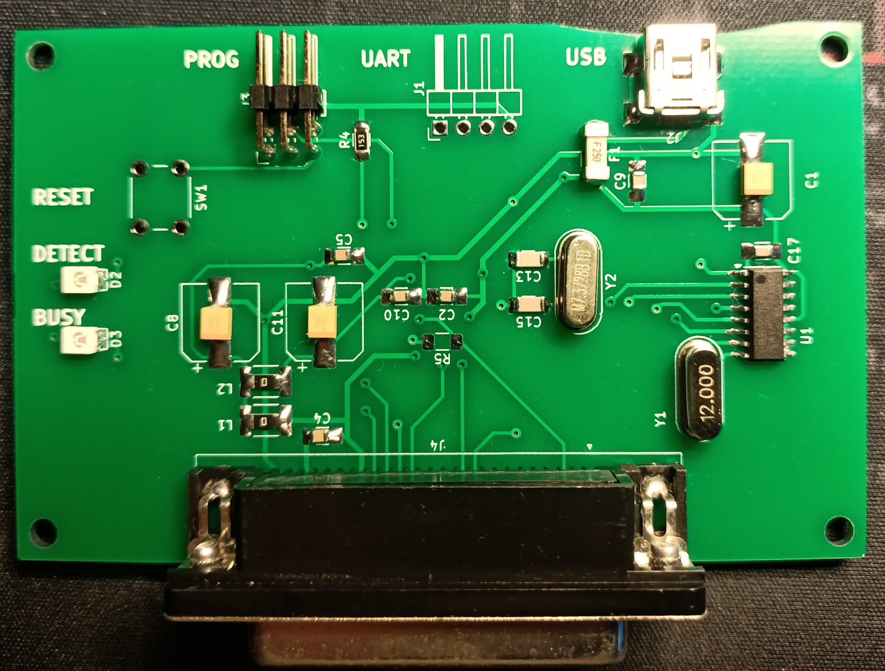
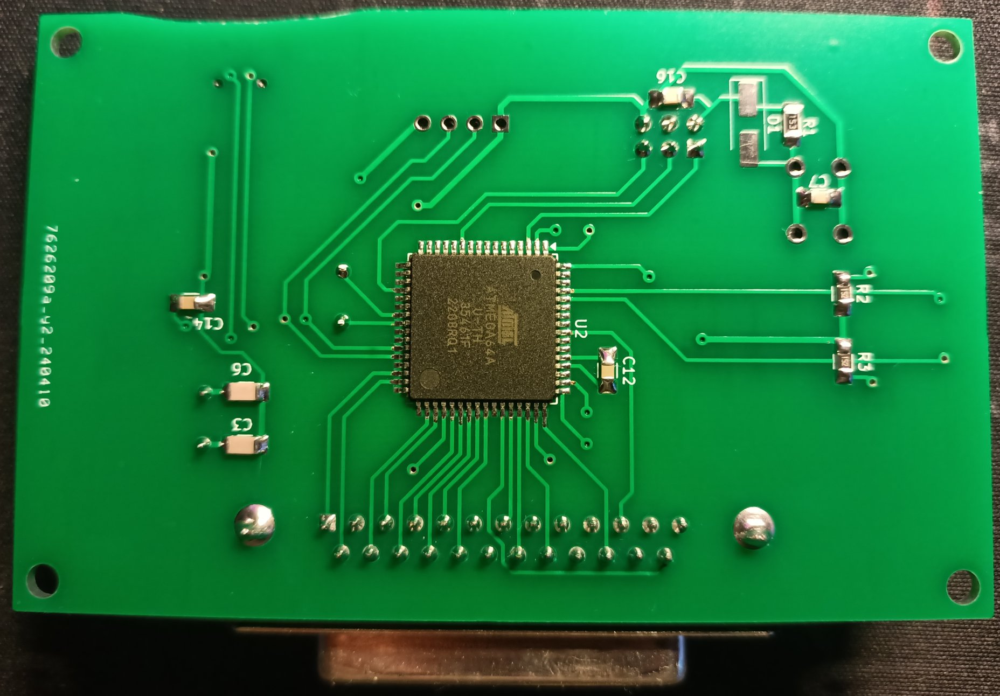

# Fiat Lancia Tester \ Alfa Romeo Tester \ Check Up 1 module reader

Dedicated module reader for FLT\ART\CU1 ROMs archiving.




# Directories organization

- **firmware** - MCU firmware, written in C.
- **pc_software** - PC software, written in Python.
- **PCB** - PCB project, prepared in KiCad version 8.0.1.
- **DS** - data sheets of used components

# Usage

Under linux:

```
reader /dev/ttyUSB0
```

Under Windows:

```
reader COM1
```

# Notes

Atmega64A fusebits should be configured as follows:

| Extended | High | Low |
| - | - | - |
| 0xFF | 0xC9 | 0x1F |