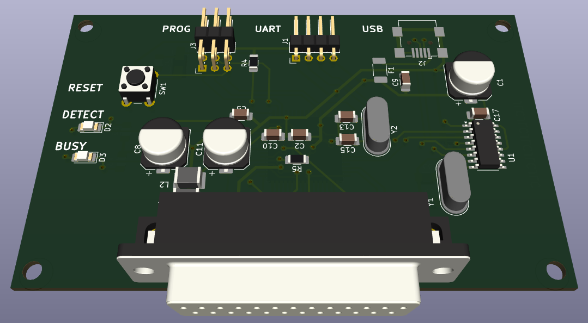

# Fiat Lancia Tester \ Alfa Romeo Tester \ Check Up 1 module reader

Dedicated module reader for FLT\ART\CU1 ROMs archiving.

# Directories organization

- **firmware** - MCU firmware, written in C.
- **PCB** - PCB project, prepared in KiCad version 8.0.1.
- **DS** - data sheets of used components
