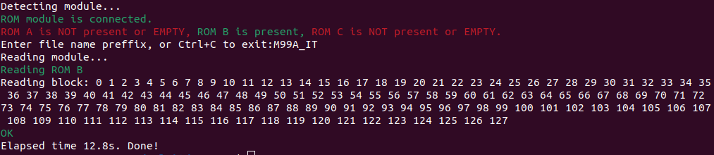

# Disclaimer

Nie wyrażam zgody na wykorzystanie całości bądź części projektu w celach zarobkowych!

# License

Shield: [![CC BY-NC-SA 4.0][cc-by-nc-sa-shield]][cc-by-nc-sa]

This work is licensed under a
[Creative Commons Attribution-NonCommercial-ShareAlike 4.0 International License][cc-by-nc-sa].

[![CC BY-NC-SA 4.0][cc-by-nc-sa-image]][cc-by-nc-sa]

[cc-by-nc-sa]: http://creativecommons.org/licenses/by-nc-sa/4.0/
[cc-by-nc-sa-image]: https://licensebuttons.net/l/by-nc-sa/4.0/88x31.png
[cc-by-nc-sa-shield]: https://img.shields.io/badge/License-CC%20BY--NC--SA%204.0-lightgrey.svg

# Fiat Lancia Tester \ Alfa Romeo Tester \ Check Up 1 module reader

Dedicated module reader for FLT\ART\CU1 ROMs archiving.


# Directories organization

- **firmware** - MCU firmware, written in C.
- **pc_software** - PC software, written in Python.
- **PCB** - PCB project, prepared in KiCad version 8.0.1.
- **DS** - data sheets of used components

# Usage

Under linux:

```
reader /dev/ttyUSB0
```

Under Windows:

```
reader COM1
```

where */dev/ttyUSB0* (on Linux) or *COM1* (on Windows) should be actual serial port name of connected ROM reader.

# Basic instructions

1. Connect the reader to the PC. Running the program on a PC without a module connected is signaled with an error.


2. If a module is connected, the reader detects which ROMs are present in connected module. In this example we have a module with all three (**ROM A, B and C**). If at least one ROM is installed in the module (and this will always be the case, because B must be present), the program will ask you to enter a prefix for the files that will be stored on the PC. I entered here, for example, *M99A_IT*. After confirming with enter, the ROM data downloading process begins:


3. Data integrity is checked using CRC on an ongoing basis, while downloading individual blocks (one block is 512 bytes). In any case, **it may be advisable to repeat the dumping operation twice, disconnecting and reconnecting the ROM module to wipe the contacts a bit**. Finally, individual files with the contents of the ROMs are stored on the PC:


The process is similar for other modules, here is an example if the module contained only **ROM A and B**:


or **ROM B** only:



The program reads the contents of only the ROMs present in the module.

# Notes

Atmega64A fusebits should be configured as follows:

| Extended | High | Low |
| - | - | - |
| 0xFF | 0xC9 | 0x1F |