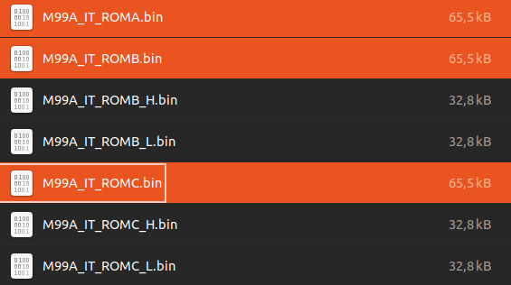
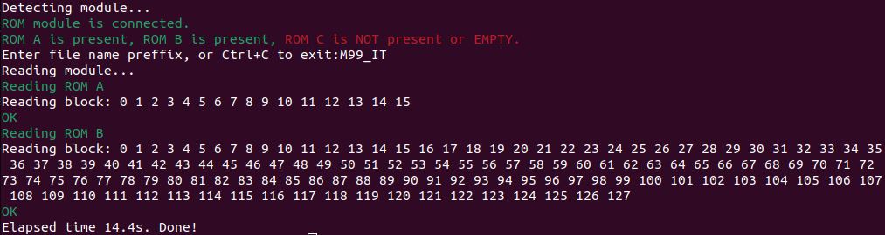

# Fiat Lancia Tester \ Alfa Romeo Tester \ Check Up 1 module reader

Dedicated module reader for FLT\ART\CU-1 ROMs archiving.

# Disclaimer

I do not consent to the use of all or part of the project for commercial purposes!

Nie wyrażam zgody na wykorzystanie całości bądź części projektu w celach zarobkowych!

# License

Shield: [![CC BY-NC-SA 4.0][cc-by-nc-sa-shield]][cc-by-nc-sa]

This work is licensed under a
[Creative Commons Attribution-NonCommercial-ShareAlike 4.0 International License][cc-by-nc-sa].

[![CC BY-NC-SA 4.0][cc-by-nc-sa-image]][cc-by-nc-sa]

[cc-by-nc-sa]: http://creativecommons.org/licenses/by-nc-sa/4.0/
[cc-by-nc-sa-image]: https://licensebuttons.net/l/by-nc-sa/4.0/88x31.png
[cc-by-nc-sa-shield]: https://img.shields.io/badge/License-CC%20BY--NC--SA%204.0-lightgrey.svg

# Directories organization

- **firmware** - MCU firmware, written in C.
- **pc_software** - PC software, written in Python.
- **PCB** - PCB project, prepared in KiCad version 8.0.1.
- **DS** - data sheets of used components

# Usage

| Windows | Linux | macOS |
| --- | --- | --- |
| reader COM[number] | ./reader /dev/ttyUSB[number] | ./reader /dev/wchusbserial[number] |

For example:

| Windows | Linux | macOS |
| --- | --- | --- |
| reader COM1 | ./reader /dev/ttyUSB0 | ./reader /dev/wchusbserial300 |

where */dev/wchusbserial300* (on macOS), */dev/ttyUSB0* (on Linux) or *COM1* (on Windows) should be actual serial port name of connected ROM reader.

# Basic instructions

1. (optional step) *search_ports* script can be used to identify ROM reader serial port name.

The ROM reader uses the CH340 serial chip, which can be identified by the VID/PID values of 1A86/7523, respectively.

2. Connect the ROM reader to the PC. Running the program on a PC without a connected module will result in an error.

3. If a module is connected, the reader detects which ROMs are present in the connected module. In this example, we have a module with all three (**ROM A, B, and C**). If at least one ROM is installed (which will always be the case, since ROM B must be present), the program will prompt you to enter a prefix for the files that will be saved on the PC. I entered *M99A_IT* as an example. After confirming by pressing Enter, the ROM data dumping process begins:

4. Data integrity is continuously checked using CRC while downloading individual blocks (each block is 512 bytes). **In most cases, it may be advisable to repeat the dumping operation twice, disconnecting and reconnecting the ROM module to clean the contacts slightly.** Finally, individual files containing the ROM data are saved to the PC:

The process is similar for other modules. Here is an example if the module contains only **ROM A and B**:

or **ROM B** only:

The program reads the contents of only the ROMs that are present in the module.

# RAM adapter

The RAM adapter is used for SRAM testing. It was primarily constructed to test the M48Z02 (used in FLT/ART) and the M48T02 (used in CU-1). The RAM adapter takes the form of a standard FLT ROM module. Additionally, it requires a connection to a supplementary 2-pin connector with the #WR signal, which is not present on the DSUB-25 connector of the ROM.

Before usage, the RAM adapter must be configured to the correct RAM variant using solder bridges (SB1 - SB3) on the PCB. The configuration is as follows:

| RAM | Size | SB1 | SB2 | SB3 |
| --- | ---- | --- | --- | --- |
| M48T02, M48T12, M48Z02 and M48Z12 | 2kB | OFF | 1-2 | 1-2 |
| M48T08, M48T18, M48Z08 and M48Z18 | 8kB | OFF | 1-2 | 2-3 |
| 62256 | 32kB | ON | 2-3 | 2-3 |

The supported commands are:

* *RAM_test ram_type serial_port*, for example: ./RAM_test M48T02 /dev/ttyUSB0

This command tests the SRAM battery and SRAM memory. The supported SRAM types (*ram_type*) for this command are:

| *ram_type* | Size | Type |
| --- | --- | --- |
| M48T02 | 2kB | battery-backed SRAM with RTC |
| M48Z02 | 2kB | battery-backed SRAM |
| M48T08 | 8kB | battery-backed SRAM with RTC |
| M48Z08 | 8kB | battery-backed SRAM |
| S62256 | 32kB | SRAM |

* *RAM_clock_cmd ram_type command serial_port*, for example ./RAM_clock_cmd M48T02 set /dev/ttyUSB0

Executes an RTC-specific command. The command (*command*) can be:

| *command* | Description |
| --- | --- |
| start | Starts the internal oscillator and enables normal clock operation. |
| stop | Stops the internal oscillator, which saves battery power if the SRAM is left on the shelf for an extended period. |
| set | Sets the current time. |
| reset | Resets all registers, stops the internal oscillator, and sets the time to 0:0:0 on 1-1-2000. |

The supported SRAM types for this command are:

| *ram_type* | Size | Type |
| --- | --- | --- |
| M48T02 | 2kB | battery-backed SRAM with RTC |
| M48T08 | 8kB | battery-backed SRAM with RTC |

* *RAM_clock_read ram_type serial_port*, for example ./RAM_clock_read M48T02 /dev/ttyUSB0

Retrieves the time from the SRAM RTC and prints it on the screen in an infinite loop at a rate of twice per second. Use Ctrl-C to stop the execution of this command.

The supported SRAM types for this command are:

| *ram_type* | Size | Type |
| --- | --- | --- |
| M48T02 | 2kB | battery-backed SRAM with RTC |
| M48T08 | 8kB | battery-backed SRAM with RTC |

# Complete procedure to test battery-backed RAM

1. Use *RAM_test* to check the RAM battery and RAM memory cells.
2. If the RAM has an RTC:

- Execute the *reset command* to reset the RAM clock.

- Execute the *start command** to starts the internal oscillator and enable normal clock operation.

- Execute the *set command* to set the current time.

- Run *RAM_clock_read* to verify both the validity of the time and that it increments. If both conditions are met, the RTC is functioning properly.

# Notes

Atmega64A fusebits should be configured as follows:

| Extended | High | Low |
| --- | --- | --- |
| 0xFF | 0xC9 | 0x1F |
